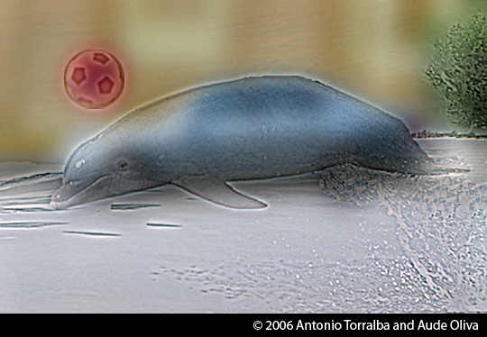
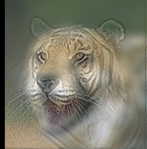

# Hybrid images

## Source

This lab is based on

- http://cs.brown.edu/courses/cs143/proj1/
- https://courses.engr.illinois.edu/cs498dh3/fa2014/projects/hybrid/ComputationalPhotography_ProjectHybrid.html
- http://cvcl.mit.edu/publications/OlivaTorralb_Hybrid_Siggraph06.pdf
- http://cvcl.mit.edu/hybridimage.htm (Link down)

## Examples

These images look different when viewed from far (or zoomed out), than when looking at close range.

## Theory

*Hybrid images* are composed from two images. A low pass filter is applied to the first one and a high pass filter is applied to the other. From a close distance the high pass filtered imaged dominates, while from a far away the low pass filtered one does. The effect works best when images are aligned.

## Exercise

### Choose images

The data folder (originally downloaded from [here](http://cs.brown.edu/courses/cs143/proj1/) ) contains several pairs of aligned images. Choose one pair, and read both images into matlab.

### Filtering

Use [imfilter](http://www.mathworks.com/help/images/ref/imfilter.html) to apply a low pass filter to one image.
For creating the high-pass filtered image, apply a low pass filter to it, and then subtract it from the original image. Mathematically: *Y = X - f(X)* , where *X* is the input image and *f* is the low pass filter. Note that this image will contain negative values.

Look at the [fft](http://www.mathworks.com/help/matlab/ref/fft2.html) and [dct](http://www.mathworks.com/help/images/ref/dct2.html) transforms of

- The original images
- The filter
- The filtered images

### Summing the images

The hybrid image is composed by adding the two filtered images. The full formula would be

*H = f1(X1) + (X2 - f2(X2) )*

Where *f1* and *f2* are low pass filters, and *X1* and *X2* are the input images. Notice that the effect depends on the cut-off frequencies of both filters (see figure 5 of the [Hybrid Images paper](http://cvcl.mit.edu/publications/OlivaTorralb_Hybrid_Siggraph06.pdf)). Additionally, you may scale the amplitude of one of the images to reduce or increase its impact. Play with this parameters to get a good Hybrid Image.

- Upload the full matlab script used to generate the image to the repository
- Upload the final image to the repository

### Visualization

In order to simulate how the image will look from different distances we can use a pyramid (see figure at the bottom of http://cs.brown.edu/courses/cs143/proj1/ ).

- Create such a visualization for your image
- Upload it to the repository

## Homework

Create a hybrid image based on images from your own collections. The more original the better. Some ideas are

- You or people you know
- Pets
- Pictures of the university or the city
- Pictures of places you have visited (preferably in Colombia)
- Be creative
- Avoid images downloaded from internet

Notice that you will have to *align and crop* the images to get a good effect. To do this you may use image edition software like gimp or photoshop. You are free to do any additional processing that you want in order to increase the effect. Also consider how to deal with color on the images.

Finally, upload to the repository

- The original images
- The processed images (cropped, aligned, color adjusted)
- A short description of each image (one paragraph)
- The final hybrid image
- The pyramid
- The code you used (with comments)

**DUE**: 3 /3 /2016 ; 8:00 a.m.
