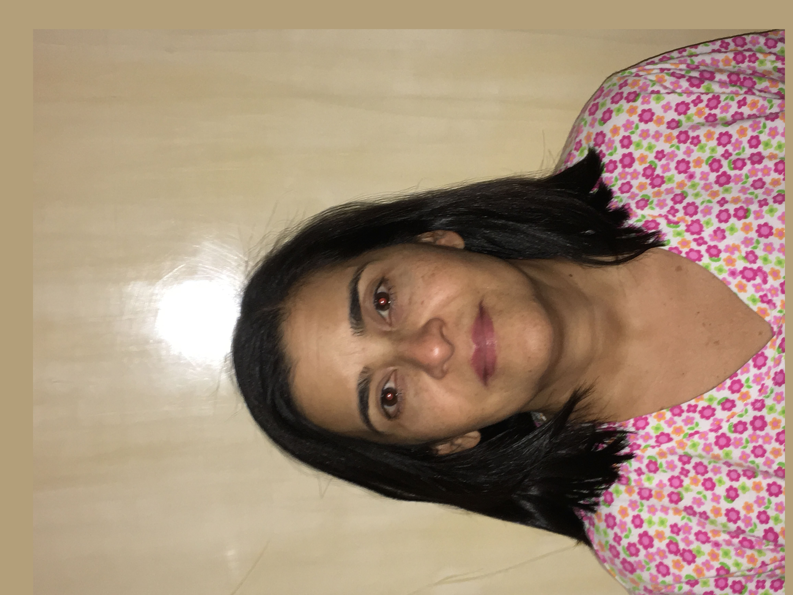

# Descripcion de las imagenes

In this lab we use the image IMG_0538.JPG and the image IMG_0538copy.jpg, wich are the final two images that I modified in order to obtein the hibrid image.

## Images

The picture above is the original image of my mother. It was taken in my house.

The past picture is the original image of my sister. It was taken in my house. This picture was not modified in order to obtein the hibrid image; it was used as it was shown above.

The picture above is the modified picture of my mother used in order to obtein the final hibrid image.

The past picture was the hibrid result obtein after execute the next command on MATLAB: ``ImagenesHibridas('IMG_0538.JPG','IMG_0538 copy.jpg')``.