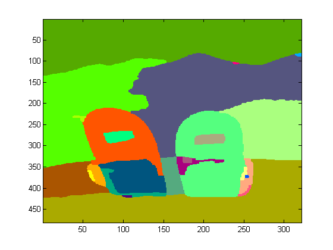

# Segmentation practice

## Data


The data for this lab can be downloaded from the following mirrors in the university

- Guainia, http: http://guiania.uniandes.edu.co/seg_images.zip
- Guitaca, ssh: ``scp vision@guitaca.uniandes.edu.co:/home/vision/seg_images.zip .``

For using ssh in windows you may use [putty](http://www.chiark.greenend.org.uk/~sgtatham/putty/download.html) 
or [filezilla](http://portableapps.com/apps/internet/filezilla_portable)  


## Implement a segmentation method

Implement your own segmentation method using what you have learned in class. It should be a matlab function with the following signature

```matlab
function my_segmentation = segment_by_clustering( rgb_image, feature_space, clustering method, number of clusters)
```
Where

- feature_space : 'rgb', 'lab', 'hsv', 'rgb+xy', 'lab+xy', 'hsv+xy'
- clustering_method = k-means, gmm, hierarchical or watershed (code seen in class).

The output of the function should be a image (or matrix) where each pixel has a cluster label.

## Test your function

To test the output of your function use something like

```matlab
image(segm)
colormap colorcube
```

You should see an image similar to the following, where each color represents a different cluster.



Try different parameters of your function, and see which ones work best. Next week we will perform a formal test of this function.

## End

Upload your function to the repository
