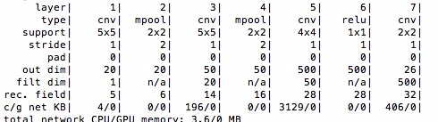
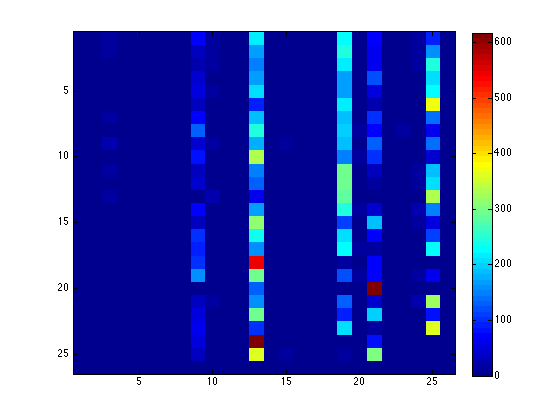
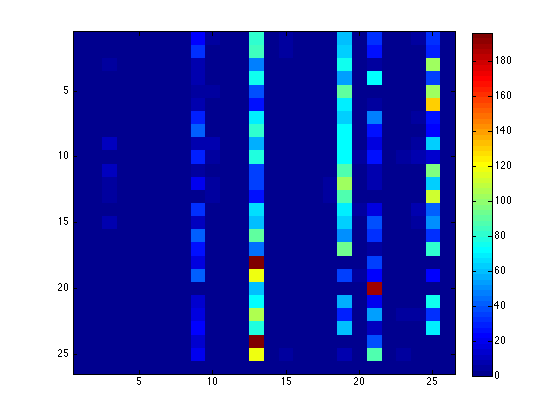

1. Network Description

Our neural network is formed by 5, the structure is shown below:

The three convolutional layers are used to extract specific patterns inside the input images. This is made by calculting image responses to different filters created previously. 
Additionally, the pooling layers were implemented in order obtain relevant information in each of the images. This information results relevant because it represents interest points inside the image regardless its scale. This layers makes a non-linesr subsampling which consists in partitioning the input image into a group pf non-overlapping patches and then extracting de maximum value for each created subregion.
The idea of using both layers in a mixed way (one after the other) is to complimment both information in order to have a better representation of the image That could be useful to classify it.

2. Results

Results on Train set are shown below:

We obtained an AP of 0.04. 

Results on the Validation set are shown below:

We obtained and AP of 0.0157

Time spended in the training stage was 0.38hours, 22,8 minutes.
